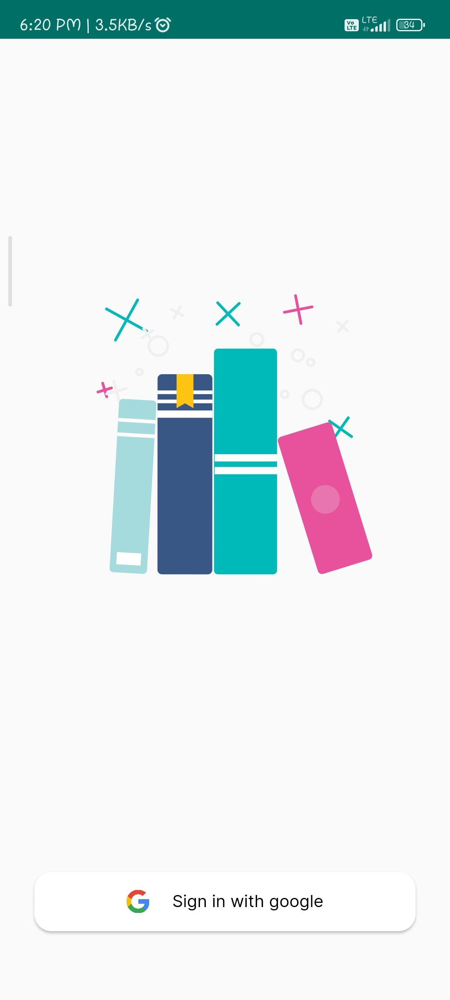
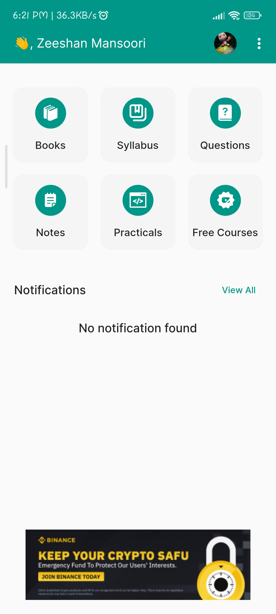
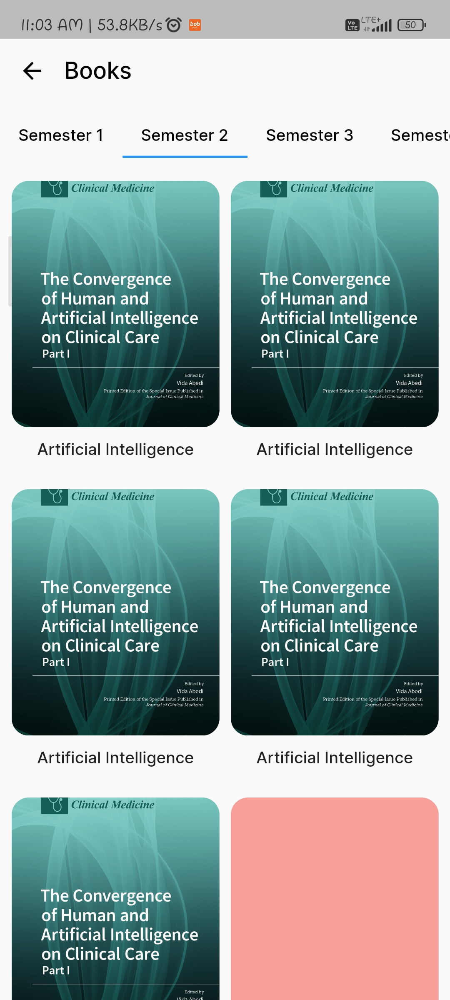
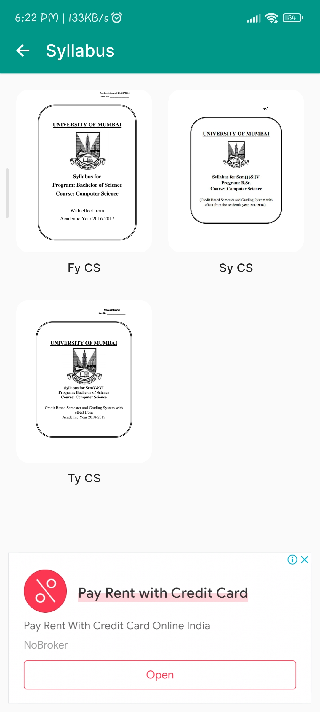
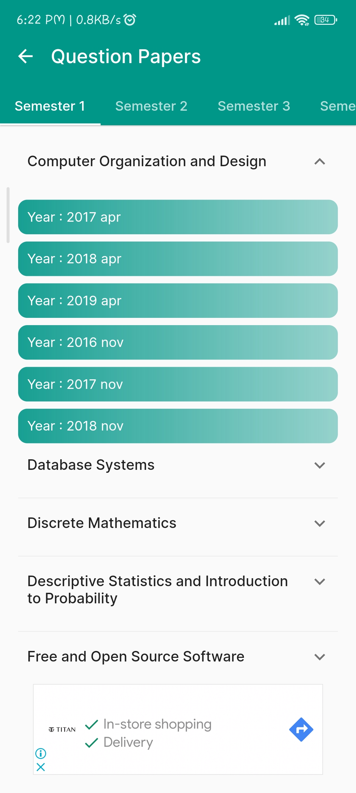
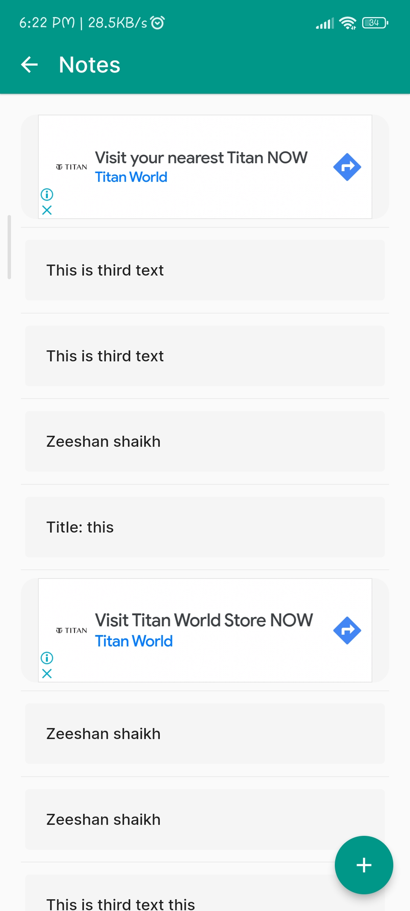
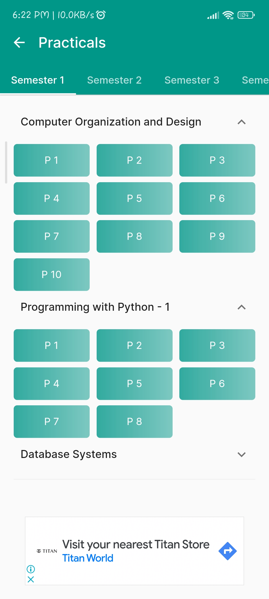
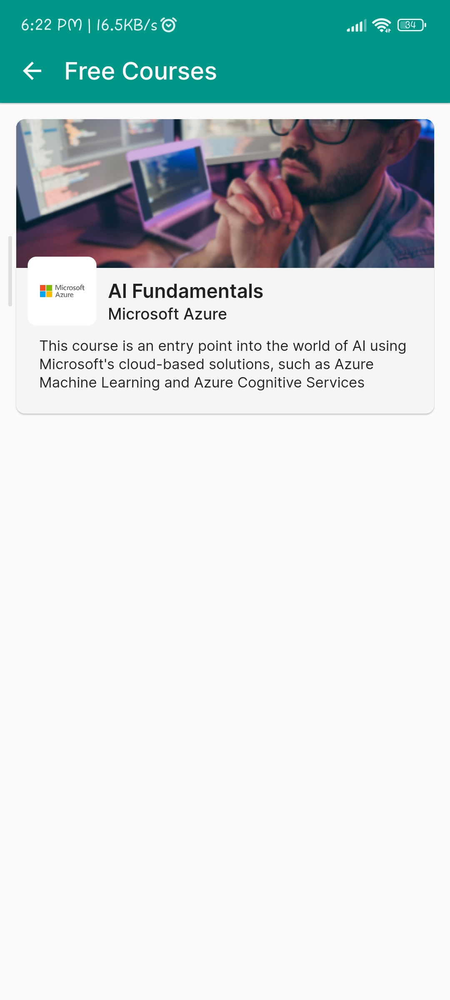
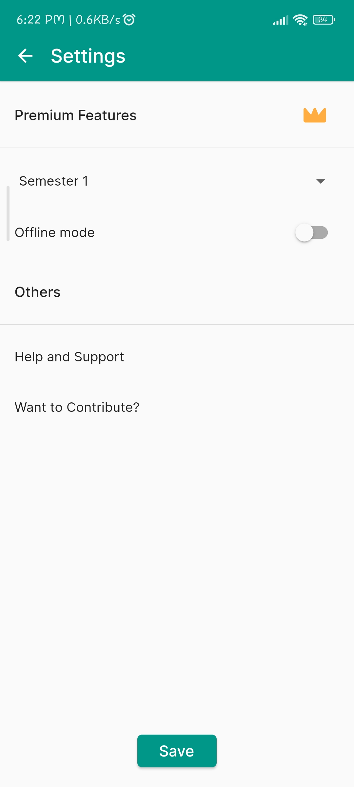
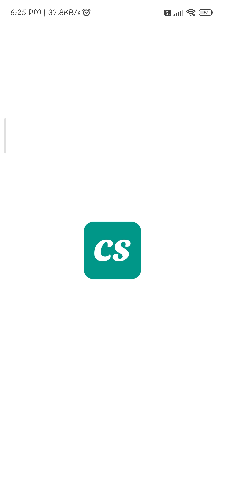

# bsccs

App for Bsc CS students.

## ⚠️⚠️⚠️ Work in progress ⚠️⚠️⚠️

## Features

## Libraries
1. Firebase

## Result

| Auth          |                     Home                  |   Books                |
|:---------------------------:|:---------------------------:|:---------------------------:|
|  |  |  | 
| Syllabus          |                     Question Papers                  |   My Notes   |
|  |  |  | 
| Practicals | Free Courses | Settings |
|  |  |  | 
|   Splash          |         Notification         |       Demo         |
|  |  | demo | 

